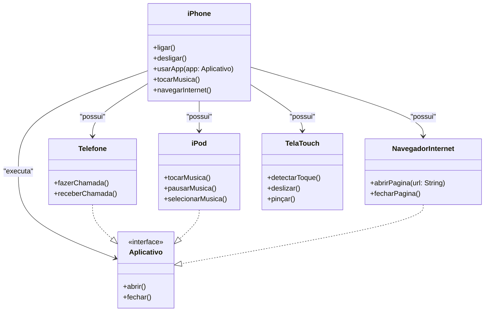

## iPhone 2007 App

Este projeto é uma simulação em Java das principais funcionalidades apresentadas no lançamento do iPhone em 2007. Desenvolvi este app com foco em boas práticas de Programação Orientada a Objetos (POO), utilizando interfaces e records para garantir um código limpo, modular e de fácil manutenção.

Durante o desenvolvimento, aprendi a importância de modelar bem as entidades do sistema, aplicar encapsulamento, reutilização de código e a criar um menu interativo para melhor experiência do usuário. O uso de records e interfaces me permitiu explorar recursos modernos do Java, tornando o projeto mais robusto e alinhado com padrões atuais.

O diagrama UML abaixo foi fundamental para visualizar a estrutura do sistema, facilitando o planejamento das classes, interfaces e suas relações. Ele serviu como guia para a implementação das funcionalidades, garantindo organização e clareza no desenvolvimento.

As principais funcionalidades modeladas incluem

- **Demo**: Classe responsável por exibir o menu interativo e gerenciar a interação do usuário com as funcionalidades do iPhone simulado. Permite acessar todas as funções implementadas de forma organizada e segura, com tratamento de erros.

As principais funcionalidades modeladas incluem

- **Reprodutor Musical**: métodos `tocarMusica`, `pausarMusica`, `selecionarMusica`.
- **Aparelho Telefônico**: métodos `fazerChamada`, `receberChamada`, `iniciarCorreioVoz`.
- **Navegador de Internet**: métodos `abrirPagina`, `fecharPagina`, `adicionarNovaAba`, `atualizarPagina`.

## Diagrama UML (iPhone 2007)

